# Pasjans
This project is implementation of collections of patience games. It consist of six different games. It's graphical interface provided by pygame package. The aim of this project is to implement fully functional game. It has not only implementation of game itself but also saves state of game. The first two sections (**How to run** and **How to play**) are users guide. For details about fields look into **Fields** section which is below. For technical details look in the next sections. Each section corresponds to one of files in main folder.

## How to run
It's compatible with python 3.5. It also needs PILLOW and pygame packages installed. The main class is Application. To run it just simply run the Application.py found in main folder. If it is first run, then it will start with loading klondike patience. If it was run before, then it will load last chosen game with it's state.

## How to play
It's static clickable game. For perform move firstly click on card which you want to move and then on the place where you want to put it. When you click on cards they will be highlighted. To see how cards are shown look into **Cards** section below. There is also menu which you can see below.

The menu options are:

-  onclick it reshuffles deck and restart patience;

-  onclick it shows new menu where you can change patience. It will read from save files state of last time played chosen patience and will load it.

-  onclick it undoes last move of cards.

### Game rules
This game consist of six different patience. Two of them use double deck, while the rest uses simply fifty two cards deck. Each one has it's own rules which are explained below.

#### Algerian patience
This is double deck game. Below is example of how this game looks like in the very beginning. Aim of this game is to put all cards on stacks shown in the top row.
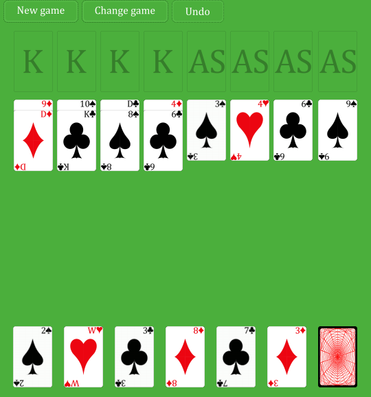
Top row consist of four descending and four ascending stack. The second row consists eight piles. In this game you can put card on another both in descending and ascending order. But this cards have to have the same suit. Also when moving more than one card remember that they will be putted in reversed order them they were belowed. The bottom row is Long Deck row with six subfields. These cards are available to be putted on top two rows. When clicked on hidden ones then new cards will be putted on subfields. When on the rightmost field there is no card then clicking on it will have no effect.

#### Canfield
This is one deck game. Again the aim is to put all cards on stacks seen in the top row. But board is a little bit different as you can see below.
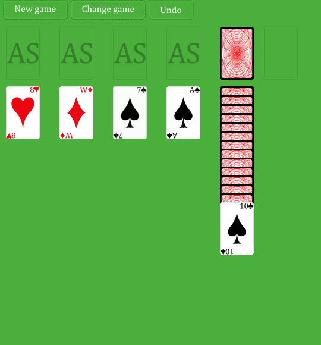
At the top row there are four ascending stacks. The next field on this row is Deck one. It shows available cards and you can go through it how many times you wish. In the second row there are four Piles. Cards putted on this piles shall be in descending order and shall be in different colors. So black on red and red on black. The last field is Unputtable Pile. It shows only last card and this card can be picked for next move but nothing can be put on it.

#### Fifteen puzzle
This is also one deck game. But aim is different from the previous two games. Here patience is completed if on thirteen out of fifteen fields there are four cards all with the same rank. At the beginning game looks like below.
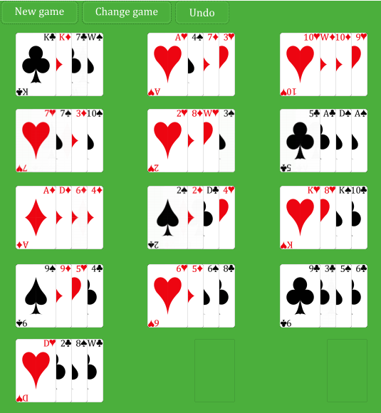
It has five rows and in each of them three Fours field. On each field may be a maximum of four cards. On field you can put only card with rank the same as the last one. When field is empty each card can be putted there. You can move multiply cards only if chosen ones are all with the same rank. At the end it doesn't matter which two fields are empty.

#### Klondike
This is one of the most popular patience. It's one deck game where aim is to put all cards on stacks. The starting board is shown below.
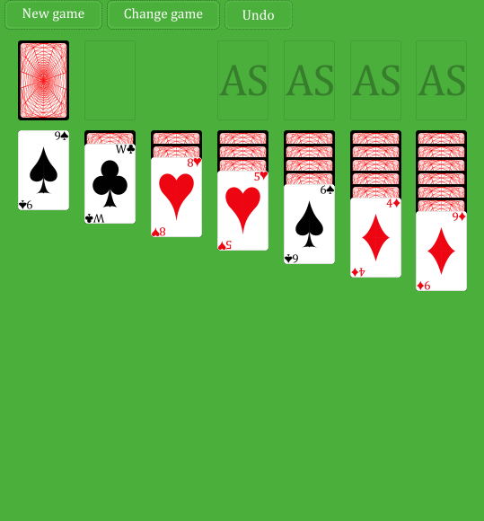
At the top left corner there is deck. It shows one card at the time and can be clicked through cards in it as many times as you like. On the right there are four ascending stacks. Here you shall put all cards. In the second row there are seven Piles. Cards should be putted in ascending order and in red on black, black on red manner.

#### Natali
This is double deck game. Again the aim is to put all cards on stacks. Below is shown how this patience look in the beginning.
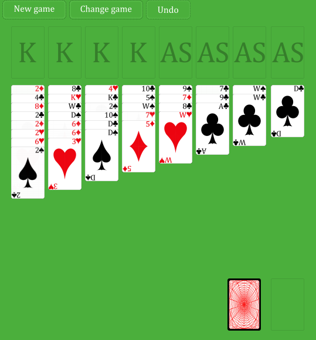
As in algerian patience in the top row there are four descending and four ascending stacks. Below are eight Piles. On these ones cards can be putted in descending and ascending order. Suit of card putted on another shall be the same. When moving multiply cards then they will be putted in reversed order then they were before move. At the bottom right there is Deck. As usual only visible card is available and Deck can be clicked through as many time as you wish.

#### Osmosis
The last game is one deck game. The aim is to put all cards on Cascade fields on the right column. At the beginning board looks like this below.
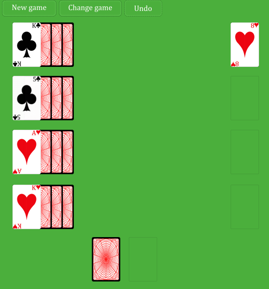
In the right column there is four Fours field. The shown card is available on move but no card can be put on them. On the left there are four Cascade fields. On the top Cascade you can put any card with the suit the same as the one already on it. On the next Cascades you can put any card that has rank the same as one of card from above Cascade. On each Cascade can be only cards with the same suits. The last thing on board is deck on the bottom center. The visible card is available for move and you can click through it as many times as you wish.

## Cards
It's card game, so cards are the most important ones. There are four suits which are:
  
There are all encapsulated in enum. In code there are called pik, trefl, kier and karo. The ranks are also an enum. And also have non-English names which are also visible on cards. These are from ace to king: AS, 2, 3, 4, 5, 6, 7, 8, 9, 10, W, D, K. In code there are available two decks. One has 52 cards where each one has different suit and rank. The second one is double deck with 104 cards. Both decks are lists consisting cards. It simply has cop of each card. The layout of card is also the same for each. For example look at king kier.
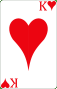
In the middle of card there is symbol of suit. It also appears in the right top and left bottom. There is also symbol corresponding to card rank. The top right pair of suit and rank symbols will be always visible. They are identifying each card. Each card can be in one of several states. Below diagram represents how this states can be achieved.

Depending in which state card is then it's on the screen shown as below. The first one is active card. On the next click it can be moved. It has white border around it to be visibly distinguished from shown cards. This is the next one. It shows layout of card without any additions. The last one is hidden card. It shows only the back of card and player can't determine which card is there.
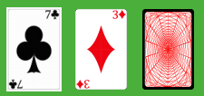
Each card is instance of class card which is to be find in Class.py in main folder. It has several methods which are:

- `draw(screen)` it is used to put layout of cards on the screen so the user will see it;

-  `change(x, y)` it is used to change position of card to given by x and y coordinates;

- `show()` and `hide()` which  are used to change state of card between shown and hidden;

- `change_active(is_active)` it switches between states active and inactive;

- `is_active()` and `is_shown()` which are used to determine state of card;

- `red_black(card)` it compares colour (not suit!) of this card and the one passed as argument and returns true if one of them is red and another one is black;

- `next_lower(card)` it compares ranks of this card and the one passed as argument. If the one in argument is lower by one (for example this card is ten and argument one is nine) then it returns true;

- `suit()` and `rank()` returns suit and rank of this card;

- `is_xml_card(xml_card)` checks whether xml node passed as argument describes this card.

## Fields
There are 7 basic field types. All of them with additional abstract Field and helper Subfield are to be found in Field.py. Basic methods which are almost always the same for all of them are:
- `hide_last()` used to simply hide last card on the field.

- `take(cards, reveal=True)` used when handling moves. It checks whether this cards are on the field. Then it removes it and checks if last one is hidden. If yes then it shows it. It returns three variables. First informs if this field had this cards, second if last was revealed and last one, which is mostly important in Long Deck, from which subfield cards were taken.

- `add(cards)` used when shuffling. Without any checking puts cards on board;

- `clear()` used when creating new game. It simply removes all cards from field;

- `show_cards()` used when saving game and checking if game was solved. It returns all cards;

- `clicked(x_moved, y_moved, x_resized, y_resized)` used to determine if clicked occurred on this field. In basic forms it takes coordinates of field and size of card to determine place where clck should be. But in some cases there is need to move or resized this place.

Beside this few basic methods each field has to implement two more methods. These are:
- `update(cards)` it is more complicated method. It has to check whether click occurred on this field and then if this was valid one. It returns two variables. The main loop determines on them if click was valid and what to do with cards. This variables are list of affected cards and field. Possible values tell that:
-- this field was not clicked when returns empty list and none;
-- this field was clicked but nothing has happend when returns empty list and self;
-- this field was clicked and active cards should be ones from it when returns some cards and none;
-- this field was clicked and already active cards should be moved to it when returns cards and self.

- `draw(screen)` it is used to show on this screen field with it's cards.

This basic fields types are:

- `Deck` it consists of two stacks of cards. The one on the right are hidden ones. When clicked on them then first one goes to the field on left. There is always one card which can be moved. When on the right are no left cards, then next click on it moves all cards from left back to it. It is unlimited how many times you get through all cards in this field. This field has additional variable index which tell where is the border between right and left cards. At the start it looks like this:
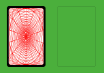

- `LongDeck` and corresponding `Subfield` are shown below. The six visible cards are on the subfields, while the last hidden one is in fact in Long Deck.
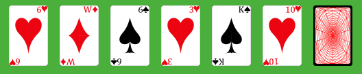
It's very similar to Deck. It also can have any card put on it and only the visible one is available. But distribution of cards is quite different. After each click on Long Deck (the hidden card) from it are taken each two cards and are putted on each subfield. When the Long Deck is empty then clicking on it has no effect.

- `Pile` it shows cards overlapping. The available ones are shown. But to move it's needed to click only this ones that are meeting the rules. There are two possible rules passed in constructor. First one bothway tells if it is possible to have cards in descending order or also in ascending one. The second rule tell us if cards should be in the same suit or should they be in different colours.
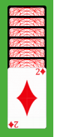 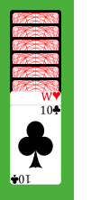 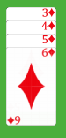
At the beginning this field can look like this first on the left image. The second one shows two cards corresponding to rule bothway=False and samecolor=False. On this pile chosen can be both jack and ten or just 10. The last image shows cards put corresponding to rules bothway=True and samecolor=True. On this pile chosen can be six or six and five, or six, five and four and so on. But while on the second image we will move it directly so ten will be overlapping jack, then on the third one the order will be reversed. So there will be five overlapping six and so on.

- `UnputtablePile` it's very similar to Pile field. The only difference is that that cards can be putted on this field. All other rules are exactly the same as in Pile described above.

- `Stack` in most games it is field where all cards should be put. In all games it starts as empty field. All cards putted on it shall be in the same suit. It also shows which card shall be first putted. If it's as then cards will be in ascending order, if king then descending. Both start states are shown below. When cards are putted on it then only the last one is shown and only this ard can be used for next move;
 

- `Fours` it can hold a maximum of four cards which are shown horizontally. The available ones are top card and the next ones which has the same rank as the top one. It also has unputable rule in constructor. It's used when we want only use cards from this field but not allow putting any on it. Below is image showing how looks fully filled fours;
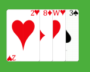

- `Cascade` it is also shown just like Fours in horizontal view. On field can be putted cards only in the same suit. But rank is also important. In the constructor there is passed reference to previous cascade. If it's none then there is possible to put cards with all ranks. But if there is some reference, then putted card rank has to be in one of the cards from previous one. Look at the example below.
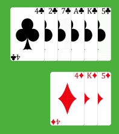
The top one has no previous so it can have any card with the same suit putted on it. Below field has reference to the top one. As you can see there is four, five and king which ranks are also in top one. The possible cards to put on it are ace, two and seven. But any other will be forbidden.

##Boards
This game consist of different board. To simplify it a board is represented as table of fields. In the Board.py file there are functions for creating them and putting cards on boards. The function name is created by concatenating game name and special keyword. These base functions are:

- `name(deck)` this is constructor of board. It also puts cards on fields by calling shuffling function. It returns list of fields filled with cards. For exact definitions what fields returns which creating function look in rules of games;

- `name_shuffle(fields, deck)` this is function that reshuffles deck and put cards from it to the fields. It also calls special `clean_and_shuffle` function which is describe below;

- `name_is_finished(fields)` checks if game represented by fields and cards on them is finished. It simply returns true or false.

There is also special function used by all boards in the same shape. It's `clean_and_shuffle(fields, deck)` function. It removes cards from all fields and then perform shuffling cards. The available names corresponding to games listed above are *algerian, canfield, fifteen_puzzle, klondike, natali and osmosis*

## XML utils
This module is for saving and loading game and also for saving and undoing moves. These functionalities are provided by several functions:

- `game_state_to_xml(board, document)` it takes board and saves it's state to the document. Board shall be list of fields and document shall be parsed by minidom parser xml document;

- `game_state_from_xml(board, deck, document)` it reads from document state of game and puts cards from deck to fields on board according to this file;

- `add_move_to_xml(idx_from, idx_to, cards, next_card_revealed, subfield, document)` it fully supports saving moves. It saves to document from which to which field cards were moved using idx\_from and idx\_to. Then it saves which cards were moved and if this move revealed card. The subfield is used when move occurres from Long Deck. It then saves from which subfield move occurred;

- `undo_last_move(board, document)` it is used when undoing last move. It simply reads last move node from xml and undoes it;

- `clean_moves_xml(document)` used when new game is used. It removes all move nodes from document.
t
Files in which game state is saved are xml while last game played name is saved in text file `last`. The name of each save file for game state is `name.xml` where names are the same as listed in the board section. The structure of this xml is as shown below.
```xml
<?xml version="1.0" ?>
<Save>
    <Moves>
    	<Move field_index_from="16" field_index_to="14" next_card_reveled="False" subfield="1">
        	<Card rank="7" suit="trefl"/>
		</Move>
    </Moves>
    <LatestCardPositions>
    	<Field>
            <Card is_shown="True" rank="4" suit="trefl"/>
            <Subfield>
                <Card2 is_shown="True" rank="K" suit="pik"/>
            </Subfield>
        </Field>
    </LatestCardPositions>
</Save>
```
The main node is Save node. It has always two direct child nodes. These are Moves and LatestCardPositions nodes. The first one collects Move nodes. Each one has four attributes and can have child nodes. First attribute tells from which one move occurred while the second to which one it happened. The next attribute tells if move revealed last card. Last one is used when dealing with Long Deck. It tells from which Subfield move occurred. The child nodes of Move tells which cards were involved. If first and second attribute is the same then we know that move was simply clicking on deck. Card node has two attributes. It's suit and rank and it's all that is needed to know with which card we are dealing. The Field nodes has no attributes but may have nodes. It can have several Card nodes and Subfield nodes. The second one also can have nodes with information about cards. To simplify handling documents the Subfield nodes have Card2 nodes.

## Application
It's the main module. It manages loading game and all clicks. The main function is `execute()`. At first it loads deck, then loads last game or new klondike game if it's first run. Then it draws board on the screen and the main loop starts. It waits for pygame.events. If it's quit then exits the loop. The second event supported is mouse click. Here is all magic covered. Firstly it checks if click occurred on one of the menu buttons. If not then it checks fields. According to where the click occurred different things happens. Different cards can become active or there can be move undone. At the end it redraws cards on the screen. After main loop is finished it saves game state to corresponding xml file and last chosen patience to another file.

